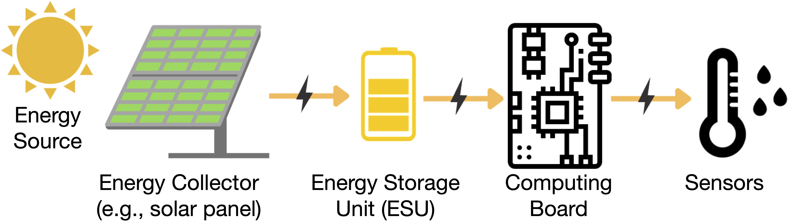
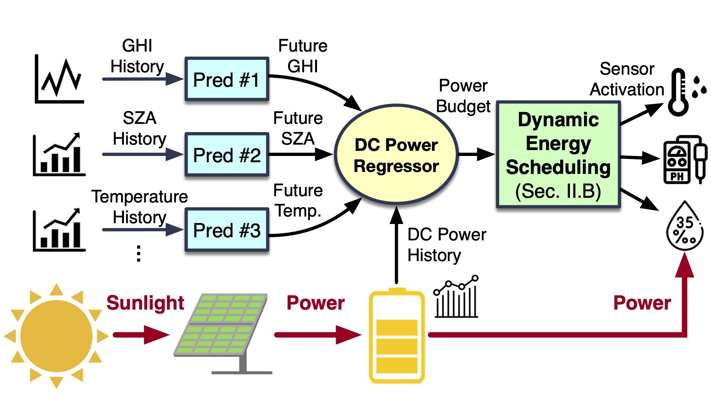

# [DynaES: Dynamic Energy Scheduling for Energy Harvesting Environmental Sensors](https://)

## What is DynaES?

[DynaES](https://github.com/kaustubhrajput46/EdgeFaaSBench) is a novel energy scheduling method for EH sensors without relying on online weather forecasts. 

DynaES comprises two components: a DC power gain estimator that predicts future power gain by individually estimating changes in environmental parameters and ensembling them, and a dynamic energy scheduler that distributes energy to sensors based on priority and adjusts sensing intervals and frequency.

## Publication
* Jianwei Hao, Emmanuel Oni, In Kee Kim, and Lakshmish Ramaswamy, "*[DynaES: Dynamic Energy Scheduling for Energy Harvesting
Environmental Sensors](https://ieeexplore.ieee.org/abstract/document/)*," In IEEE International Performance Computing and Communications Conference (IPCCC), 2023

## Scheme

Energy Harvesting IoT system pipeline:

  
  <h3>Energy Harvesting IoT system pipeline</h3>

Scheme:

  

